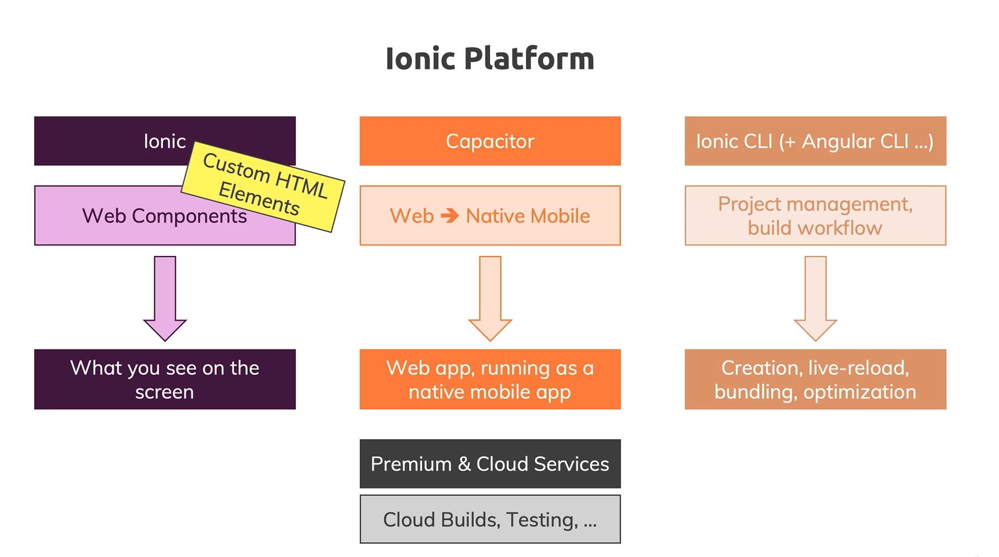
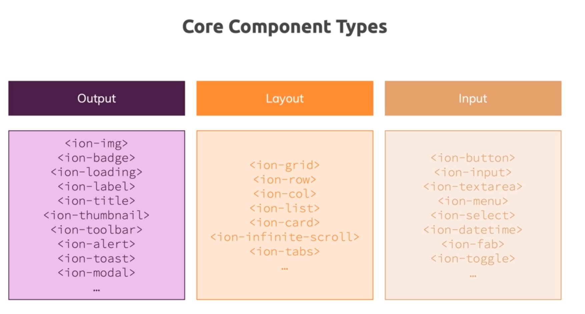
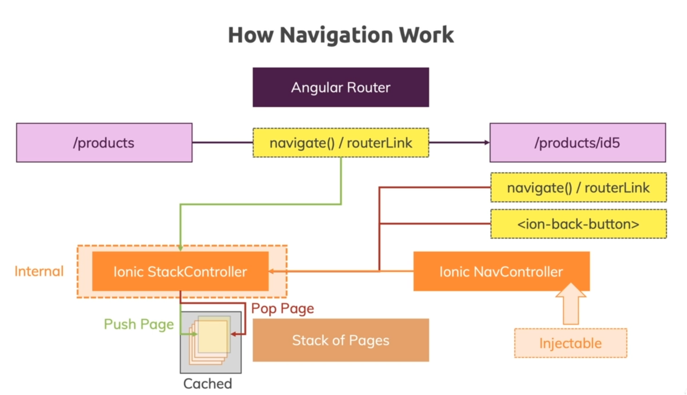
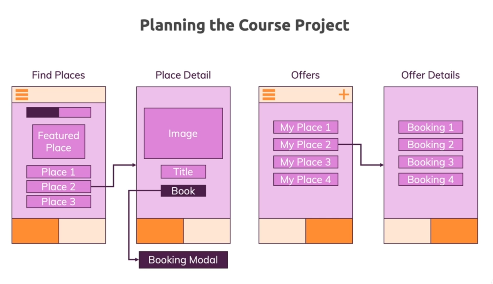
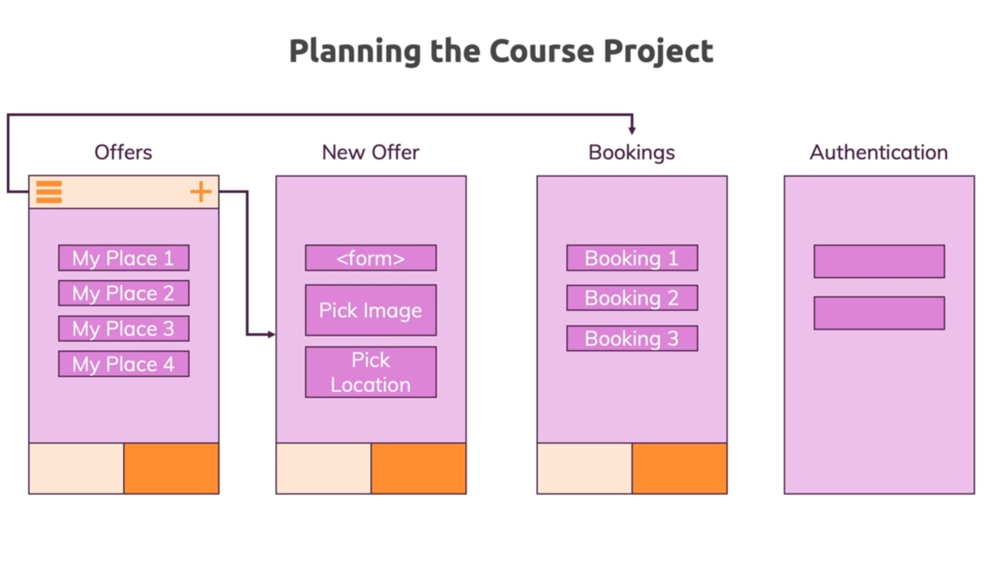
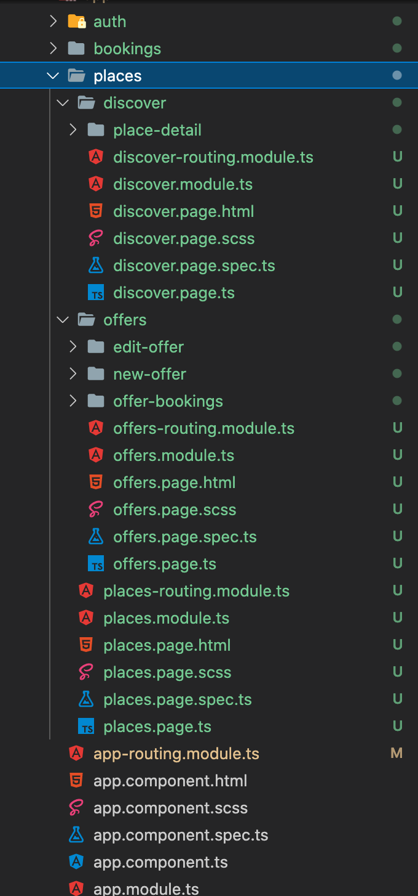

# Ionic & Angular




## Ionic Component




https://ionicframework.com/docs/api


## Angular & Ionic


Generate new components, pages, etc 

```bash
$ ionic generate
```


## Build Native Apps with Capacitor


https://ionicframework.com/docs/developing/android


```bash
$ ionic capacitor run android
```


live reload

```bash
$ ionic capacitor run android -l --external
```


Debugging Android Apps

* Check log message in the `Run`


* `Chrome://inspect`


https://code.visualstudio.com/docs/nodejs/angular-tutorial#_debugging-angular


https://developer.chrome.com/docs/devtools/


https://developer.apple.com/library/archive/documentation/NetworkingInternetWeb/Conceptual/Web_Inspector_Tutorial/Introduction/Introduction.html#//apple_ref/doc/uid/TP40017576-CH1-SW1


## Navigation & Routing in Ionic Apps




## Course Project










1. Add tabs in the `places.page.html`
2. config routes in the `places-routing.module.ts`


3. create `place.service.ts` and `place.model.ts` 
4. add mock data in the `place.service.ts` and output places in the `discover.page.html`

5. Edit `place-detail` component to display place details


6. Edit `offers` component -> `offer-booking` component -> `new-offer` component -> `edit-offer` component


**Adding a sideDrawer**

1. Add `ion-menu` in the `app.component.html`
2. In the `offer.page.html` add button to displace sideDrawer

programmatically way

3. Edit the `place-detail.page.html ` and `discover.page.ts`


**Adding Auth service**

1. modify auth components and add `auth.service.ts`

   

**Adding an Auth guard**

1. craete `auth.guard.ts` under `auth`
2. bring `auth.guard.ts` to `app-routing.module.ts`


**Opening a Modal**

1. `ionic g c bookings/create-booking`
2. Edit `create-booking.component.html`
3. Edit `place-detail.page.ts` (this page uses the modal)
4. Add `CreateBookingComponent` into `place-detail.module.ts`
5. Passing data between `place-detail.page.ts` and `CreateBookingComponent`


https://ionicframework.com/docs/angular/navigation


**prepare for Android**

https://ionicframework.com/docs/developing/android


